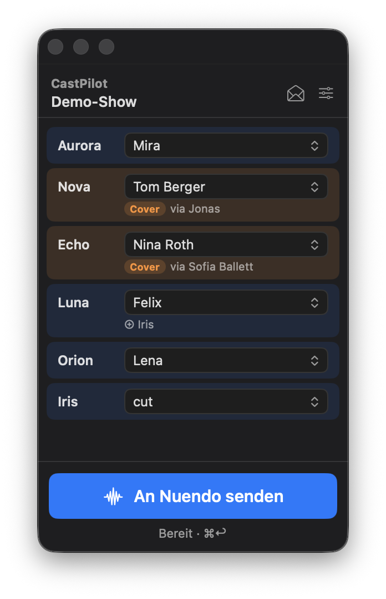
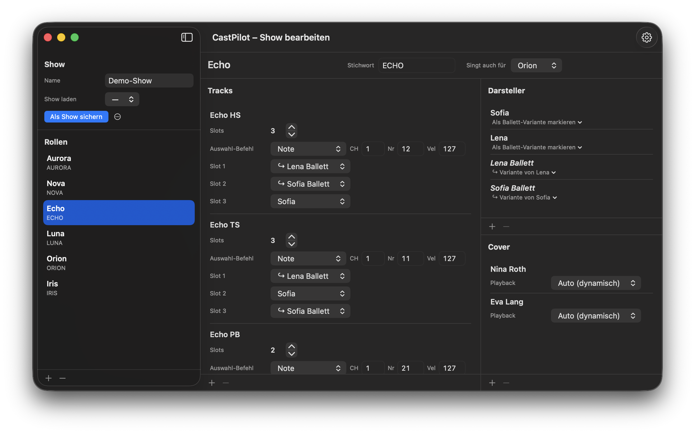

# CastPilot · `feature/covers` branch

> ⚠️ **Experimental branch.** This is the development version with ballet-cover and track-variant support. For the stable release without these features, switch to the [`main`](https://github.com/omegajani/CastPilot/tree/main) branch.

> **Names:** formerly *Midi Cast Switcher (MCS)*. The app has been called **CastPilot** (`CastPilot.app`) since v2.0, and since v2.2 the GitHub repo is **`omegajani/CastPilot`** too. Old `Midi-Cast-Switcher` links redirect automatically. The bundle ID and the config location (`~/Library/Application Support/MidiCastSwitcher/`) are unchanged, so existing configs and show files keep working.
> Since v2.1.3 the virtual MIDI source is called **CastPilot Source**. Re-select it once in Nuendo's Generic Remote on every machine.

A compact macOS utility for live shows. It automates Nuendo track version switching based on the daily cast, including ballet covers who borrow playback from absent principals.

<table>
  <tr>
    <td align="center"><br><sub>Live window</sub></td>
    <td align="center"><br><sub>Show editor</sub></td>
  </tr>
</table>

## What it does

In live shows running with Nuendo, each role (e.g. *NOVA*, *AURORA*, *ECHO*) has several performers, each recorded on a separate **Track Version**. The cast changes every day. CastPilot sends the exact MIDI sequence needed to select each track and move to the right version, all in one click.

On top of the basic principal-per-slot mapping, this branch adds two related concepts.

### Cover (ballet doubles)

Ballet performers who don't sing themselves but borrow a principal's playback. There are two modes:
- **Fixed:** e.g. *Clara covers Aurora* and always uses Mira's playback.
- **Dynamic:** e.g. *Max covers Luna*. CastPilot automatically picks the Luna principal who is **not** live in the show today and uses that playback.

### Ballett-variant tracks

Many Nuendo tracks come in two flavours per principal: a plain version and a *"& Ballett"* variant. When you link a variant member to its principal, CastPilot picks the right version per track automatically:

- **Principal live:** use the principal's own slot. Fall back to the variant slot if the track has no plain version.
- **Cover active:** use the variant slot ("& Ballett"). Fall back to the principal slot if the track has no variant.

You don't need a global "ballet today" toggle, because these rules resolve correctly from the slot assignments alone.

## Live window

- **Always on top of Nuendo.** It is about 280 px wide and shows one row per role.
- **Cast menu.** Each role's menu lists the principals first, then the covers in their own **Cover** section. Ballett-variant members are hidden here.
- **Covers are orange.** When a cover is selected, the row turns orange and shows a **Cover** tag plus the resolved playback source (*via Sofia Ballett*). A ⚠ appears when several principals are absent, or when no playback is free.
- **⊕ *Role*** shows when this role also sings the lines of a role that is *cut* today.
- **An Nuendo senden (⌘↩)** fires the complete sequence. The status line underneath shows *Sende … → ✓ Gesendet 20:14 · 6/6 Rollen*. It warns **Besetzung geändert — noch nicht gesendet** if the cast changes after sending.
- **Show name** in the header, with an orange dot while the show has unsaved changes.
- **Header buttons.** ✉ imports today's cast from e-mail. The slider icon opens the show editor.

## Show editor

It opens from the slider icon in the live window.

- **Sidebar.**
  - The **Show** block: the open show and whether it is saved (*Gespeichert · file* or *● Nicht gespeichert*). Opening and saving happen in the **File** menu, see [Shows](#shows-file-menu).
  - Below it the list of roles, with **+ / −**.
- **Role header.** The role name, its **Stichwort** (the role name as it appears in the cast e-mail) and **Singt auch für** (use the Ballett variants when that role is *cut*).
- **Tracks.** For each Nuendo track:
  - its name,
  - **Slots** (the number of track versions in Nuendo),
  - **Auswahl-Befehl** (the MIDI command that selects the track),
  - one **Slot 1…n** dropdown per version.
- **Darsteller.** Drag to reorder. The order drives the live menu and the priority of dynamic covers. Link a member as a Ballett variant with *Als Ballett-Variante markieren*.
- **Cover.** Each cover has a name and a **Playback** setting: *Auto (dynamisch)* or a fixed principal.
- **MIDI preview.** Select a performer to see the sequence that will be sent.
- **Deleting.** Every list has a **+ / −** bar below it, and each row has **Löschen** in its context menu.

## Shows (File menu)

A show is a file (`.castpilot`), like a document. Opening and saving live in the **File** menu:

| Menu item | Shortcut | What it does |
|---|---|---|
| Neue Show | ⌘N | starts a new show with starter roles |
| Show laden … | ⌘O | opens a show file; the show folder is the default |
| Zuletzt verwendet | | the last 10 shows |
| Show speichern | ⌘S | saves to the open file; a new show asks for a name |
| Show speichern unter … | ⇧⌘S | saves under a new name; the file name is the show name |
| Im Finder zeigen | | reveals the file; copy or delete shows there |

- **A show file contains** the roles, tracks, performers, covers, Ballett variants, e-mail keywords and the previous/next track-version commands.
- **Each Mac keeps its own** MIDI output, e-mail account, timing and today's cast (in `config.json`). Opening a show from another machine never changes them, and changing the cast doesn't count as a change to the show.
- **Unsaved changes** show an orange dot in the live window and the editor. CastPilot asks before another show replaces them. The working copy stays in `config.json`, so nothing is lost after a restart.
- **Finder:** double-click a `.castpilot` file to open it. Show files from older versions open too.
- **Show folder:** `~/Library/Application Support/MidiCastSwitcher/Shows/`

> **Mixed versions:** CastPilot 2.2.1 and older read a new show file as a complete configuration and reset MIDI output, timing and e-mail server to their defaults. Update every machine to 2.3 before exchanging show files.

## Settings (⌘,)

- **MIDI:**
  - the output: the virtual *CastPilot Source*, a USB interface or an Apple Network MIDI session,
  - *Verzögerung* (the pause between commands) and *Pause zwischen Rollen*,
  - the *Vorherige / Nächste Track-Version* commands.
- **E-Mail:** IMAP server, port and user. The password is stored in the macOS Keychain.
- **Update:** checks GitHub and updates the app in-app with one click.

## Features

- **Send to Nuendo in one click.** It fires the complete MIDI sequence for all assigned roles and shows a status line afterwards.
- **E-mail import.** It fetches the daily cast e-mail via IMAP and parses the role assignments. A confirmation view follows, with unmatched roles flagged in red.
- **Auto-resolved covers.** Names are matched across roles, so Sofia-in-Aurora counts as Sofia being live in Echo even though the UUIDs differ.
- **Show files.** Open, save and recent shows from the File menu; a double-click in the Finder opens a show.
- **Virtual MIDI source.** It appears as *CastPilot Source* in Nuendo and Cubase. A hardware or Network MIDI output can be used instead.
- **In-app update.** Go to Settings → Update → *Jetzt aktualisieren*.
- **Debug trace.** `fireMidi` prints the resolved per-track logic and the complete MIDI schedule to the console.

## Requirements

- macOS 14.0 or later
- Nuendo or Cubase (any version with Track Versions and MIDI remote)

## Install (Terminal, only needed once)

From **v1.9** onward CastPilot updates itself in-app (Settings → Update → *Jetzt aktualisieren*). You only need the Terminal command for the **first** install, or when migrating from a sandboxed build ≤ 1.8, which can't replace itself.

The command downloads release **v2.3.0** of this branch and removes any old `Midi Cast Switcher.app`. It then installs `CastPilot.app` and copies the example `config.json` only if none exists yet:

```bash
curl -sL "$(curl -sL https://api.github.com/repos/omegajani/CastPilot/releases/tags/v2.3.0 | python3 -c "import sys,json; d=json.load(sys.stdin); print(d['assets'][0]['browser_download_url'])")" -o /tmp/MCS.zip && \
unzip -qo /tmp/MCS.zip -d /tmp/MCS && \
rm -rf "/Applications/Midi Cast Switcher.app" "/Applications/CastPilot.app" && \
mv "/tmp/MCS/CastPilot.app" /Applications/ && \
xattr -cr "/Applications/CastPilot.app" && \
mkdir -p "$HOME/Library/Application Support/MidiCastSwitcher" && \
CFG="$HOME/Library/Application Support/MidiCastSwitcher/config.json" && \
[ -f "$CFG" ] || cp /tmp/MCS/config.json "$CFG" && \
rm -rf /tmp/MCS /tmp/MCS.zip && \
open "/Applications/CastPilot.app"
```

> **Note:** This branch is published as pre-releases on GitHub, so `releases/latest` resolves to the stable v1.6 on `main`. That is why the script targets the tag explicitly.

> **Config location:** Since v1.9 the sandbox is off, so the config lives at `~/Library/Application Support/MidiCastSwitcher/config.json`. When you upgrade from an older sandboxed build, the config is migrated out of the old container on first launch.

## Building from source

```bash
git clone -b feature/covers https://github.com/omegajani/CastPilot.git
cd CastPilot
open "Midi Cast Switcher.xcodeproj"
# Cmd+R in Xcode
```

To build from the command line:

```bash
xcodebuild -project "Midi Cast Switcher.xcodeproj" -scheme "Midi Cast Switcher" -configuration Release -derivedDataPath build build
```

## Configuring covers

### Add a cover

Show editor → pick a role → under **Cover** click **+**, then set:
- the name (e.g. *Nina Roth*)
- **Playback**, one of:
  - **Auto (dynamisch):** CastPilot picks the absent principal at send time.
  - any specific principal, for a fixed mapping.

### Mark a member as ballet variant

Show editor → pick a role → in the **Darsteller** list, click *Als Ballett-Variante markieren* under the member → pick the parent principal. The member turns italic, shows *↪ Variante von X*, and disappears from the live menu. In slot dropdowns, variants are marked with ↪.

### Naming convention (not enforced)

Variants are typically named `{Principal} & Ballett` so they match Nuendo's track version names. Any name works, though, because the link is made by UUID, not by name.

## MIDI setup in Nuendo

1. Open **Studio → MIDI Remote** (or Generic Remote, depending on your version) and import `midi list nuendo.xml` from the release zip.
2. Select **CastPilot Source** as the input device, or your USB interface / Network MIDI session.
3. Map *step up / step down* to **Track Version: Select Previous / Select Next**. These match *Vorherige / Nächste Track-Version* in CastPilot's settings.
4. Assign each track's select command to the corresponding **Select Track** action.

**Slot order matters:** CastPilot slot N maps to Nuendo's N-th track version. Configure them in exactly the same order on both sides.

## E-mail import

CastPilot can fetch the daily cast e-mail directly via IMAP:

1. **Set up once:** Settings (⌘,) → **E-Mail** → enter server, port, username and password (stored in the macOS Keychain) → *Sichern*.
2. **Each show:** click the envelope icon in the live window. CastPilot fetches the newest e-mail with *"Cast Information"* in the subject, applies the recognised assignments and opens the verification window. Unrecognised roles are shown in red.

The link between role and e-mail is the role's **Stichwort** in the show editor (e.g. `AURORA`, `NOVA`, `ECHO`).

## What's new in 2.3

- **Shows are documents:** *Show laden*, *Show speichern*, *Show speichern unter* and *Zuletzt verwendet* in the File menu, an orange dot for unsaved changes, a prompt before they are replaced, and double-click in the Finder.
- **Show files contain only the show.** MIDI output, e-mail account, timing and today's cast stay on each Mac.
- The editor's show block is reduced to the show name and its save status. New *Live-Fenster* item (⌘L) in the Window menu.
- The MIDI output is unchanged. It was verified against 2.2.1.

## What's new in 2.2

- **Redesigned, consistent UI:** German labels throughout, with Cover / Slot / Playback / Track kept as jargon. Headers, labels, buttons and +/− bars are uniform.
- **Live window:**
  - equal-width cast menus,
  - covers highlighted in orange,
  - a send status line and ⌘↩ to send,
  - a warning when the cast changed after sending.
- **Show editor:**
  - roles in a sidebar (the list was cut off before),
  - a role header,
  - drag-to-reorder performers,
  - delete via the +/− bars or the context menu.
- **New Settings window (⌘,)** for MIDI, e-mail and updates.
- **Repo renamed** to `omegajani/CastPilot`.
- The MIDI output is unchanged. It was verified byte for byte against v2.1.3.
- **2.2.1:** the bundled example `config.json` and Nuendo XML are a neutral demo show.

## Built with

SwiftUI · CoreMIDI · Network.framework · macOS 14
